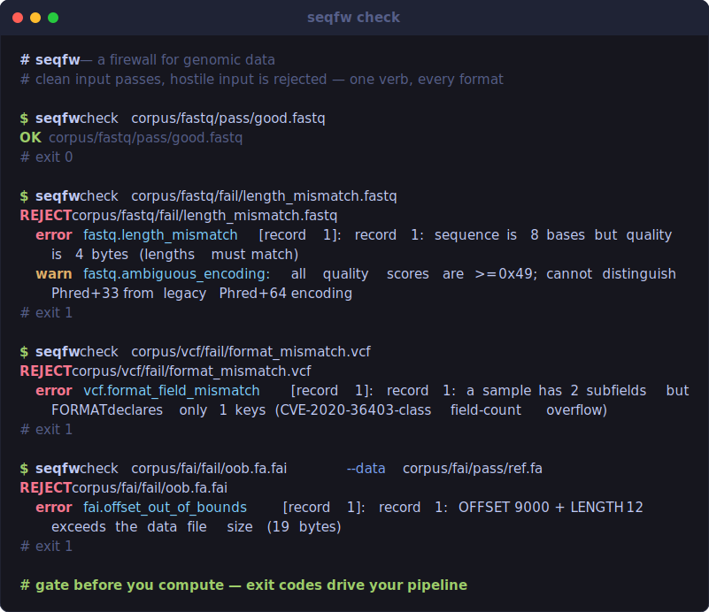

<div align="center">

# seqfw

**A firewall for genomic data** — reject malformed, malicious, and
resource-exhausting files *before* they reach your memory-unsafe parser.

[](https://github.com/catancs/seqfw/actions/workflows/ci.yml)
[](LICENSE)
[](https://www.rust-lang.org)
[](https://www.python.org)
[](#why-it-matters)



</div>

**Genomic parsers (htslib, samtools, BioPython) are memory-unsafe C that runs on
files from strangers.** `seqfw` is the validation gate you put in front of them:
it streams FASTQ / FASTA / VCF and their index files at the trust boundary and
**rejects malformed, malicious, or resource-exhausting inputs before they reach
the parser** — one fast, zero-config, offline `check`.

Think `samtools quickcheck`, but built for *adversarial* input: it blocks
decompression bombs and inputs that crash real, unmodified htslib — and we ship a
[reproducible benchmark](#the-proof) that proves it.

Drop it in front of the expensive step — the exit code decides whether you compute:

```console
$ curl -s "$URL" | seqfw check - && bwa mem ref.fa "$URL"
```

---

## Install

### Prebuilt binary — no toolchain, no clone

The quickest way in. One command downloads the right binary for your platform
(Linux x86_64, macOS arm64/x86_64) and drops `seqfw` in `~/.local/bin`:

```bash
curl -LsSf https://github.com/catancs/seqfw/releases/latest/download/seqfw-installer.sh | sh
```

Prefer to do it by hand? Grab a tarball from the
[latest release](https://github.com/catancs/seqfw/releases/latest) and put the
`seqfw` binary on your `PATH`.

### Python library

The same validation engine, importable as `seqfw` (see [Python](#python--same-engine-first-class-library)):

```bash
pip install seqfw
```

### Homebrew

```bash
brew install catancs/seqfw/seqfw
```

### From source

Any platform with a Rust toolchain — and the path for architectures without a
prebuilt binary yet:

```bash
git clone https://github.com/catancs/seqfw && cd seqfw
cargo build --release
./target/release/seqfw check your.fastq.gz   # exit 0 = clean, 1 = rejected, 2 = tool error
```

> The prebuilt, `pip`, and Homebrew channels publish from the tagged `v0.1.0`
> release; building from source tracks `main`. See [docs/RELEASING.md](docs/RELEASING.md).

## Use — one verb, every format

```bash
seqfw check sample.fastq.gz                   # FASTQ framing + content (auto-detected, gz/bgzf ok)
seqfw check - < sample.fastq                  # read stdin
seqfw check sample.fastq --json               # machine-readable findings (for CI / platforms)
seqfw check R1.fastq.gz --mate R2.fastq.gz    # paired-end sync check
seqfw check sample.fastq --strict-dna         # enforce ACGTN (default is full IUPAC)
seqfw check sample.fasta                      # FASTA structure + identifier hygiene
seqfw check input --format fastq              # force a format instead of sniffing
seqfw check cohort.vcf.gz                     # VCF header/record/tag + CVE-2020-36403 FORMAT safety
seqfw check ref.fa.fai --data ref.fa          # index offsets in-bounds vs the indexed file
```

Try it on the bundled fixtures — clean inputs pass, malformed ones are rejected with a named rule:

```bash
seqfw check corpus/fastq/pass/good.fastq          # OK
seqfw check corpus/fastq/fail/length_mismatch.fastq   # REJECT  fastq.length_mismatch
seqfw check corpus/vcf/fail/format_mismatch.vcf       # REJECT  vcf.format_field_mismatch
seqfw check corpus/fasta/fail/duplicate_name.fasta    # REJECT  fasta.duplicate_name
```

Every rule ID (`fastq.length_mismatch`, `vcf.format_field_mismatch`, …) is documented in
**[docs/RULES.md](docs/RULES.md)**.

## Python — same engine, first-class library

```python
import seqfw

report = seqfw.check("user_upload.fastq.gz")        # also: check_bytes(b"...")
if not report.ok:
    raise ValueError(report.reason)                 # newline-joined error findings

for f in report.findings:
    print(f.severity, f.rule, f.message, f.record)

seqfw.check("sample.fasta", format="fasta")         # force a format
seqfw.check("reads.fastq", strict_dna=True)         # enforce ACGTN
seqfw.check_pair("R1.fastq.gz", "R2.fastq.gz")      # paired-end sync
seqfw.check_index("ref.fa.fai", data="ref.fa")      # index-bounds (.fai/.gzi/.tbi/.csi)
```

Build from source today with `pip install maturin && maturin develop` from `crates/seqfw-py`.

---

## Why it matters

A genomics platform, core facility, or pipeline accepts files it did not create and
hands them straight to C parsers with a [long history of memory-safety
CVEs](docs/superpowers/specs/2026-06-11-seqfw-genomic-firewall-design.md). `seqfw`
is the cheap, fail-closed gate in front of that — designed to a hard usability
contract: **zero config, streaming in bounded memory** (validate a 200 GB file in
constant RAM), **sub-second**, **offline** (zero network, zero telemetry — a
security tool must never phone home), clear exit codes, reads stdin.

### Threat model — what v1 defends against

| Threat | How an attacker uses it | seqfw response |
|---|---|---|
| **Decompression bomb** | A tiny `.gz`/`.bgzf` that expands to TBs, exhausting disk/RAM in your pipeline | Absolute + ratio caps on decompressed bytes → `transport.decompression_bomb`. *No other genomic validator does this.* |
| **Parser-crashing record** | Malformed VCF FORMAT counts (CVE-2020-36403 shape) that trigger OOB reads/writes in htslib | Structural field-count validation → `vcf.format_field_mismatch` |
| **Impossible index counts** | Index headers (`.gzi/.tbi/.csi`) with integer-overflowing entry counts (CVE-2026-31970 class) | Bounds + sanity checks → `gzi.bad_entry_count`, `tabix.impossible_count` |
| **Out-of-bounds offsets** | Index offsets pointing past the data file → OOB seeks downstream | Offset-in-bounds checks vs `--data` length → `*.offset_out_of_bounds` |
| **Identifier injection** | Shell metacharacters / path traversal / control bytes in read or sample names that flow into shell commands or filenames | Identifier hygiene screening → `safety.shell_metachar`, `safety.path_traversal`, `safety.control_char` |
| **Unbounded memory** | A single multi-GB line, or a huge index file, to OOM the validator itself | Per-line and per-index byte caps → `*.line_too_long`, `index.too_large` |

## How it compares

| | adversarial-input framing | decompression-bomb defense | security benchmark | rejects (vs salvages) | CLI **+** Python lib |
|---|:---:|:---:|:---:|:---:|:---:|
| **seqfw** | ✅ | ✅ | ✅ | ✅ | ✅ |
| PipeVal | ➖ integrity/correctness | ❌ | ❌ | ✅ | ❌ |
| `samtools quickcheck` | ❌ | ❌ | ❌ | header+EOF only | ❌ |
| `seqkit sana` | ❌ | ❌ | ❌ | ❌ salvages | ❌ |
| `fastQValidator` / `vcf-validator` | ❌ | ❌ | ❌ | ✅ | ❌ |

The honest moat is **framing + decompression-bomb defense + the crash benchmark**, not
novel parsing — see design spec §4 for the full positioning and citations.

## The proof

A reproducible harness (`benchmark/`) produces three honest numbers (design spec §8):

```bash
make benchmark-local   # block rate + false positives + overhead (no Docker)
make benchmark         # adds "harm prevented" vs ASAN-built pinned htslib 1.10.2
```

Verified result: **block rate 6/6 = 100%**, **false positives 0/9 = 0%**, overhead
~4–12 ms on multi-MB valid files, and **harm prevented = 1** — the malformed-VCF
reproducer (CVE-2020-36403 FORMAT-field shape) triggers a sanitizer-detected crash
in **real, unmodified, ASAN+UBSan-built htslib 1.10.2**:

```
bcftools view → kstring.c:156:21: runtime error: applying zero offset to null pointer
               SUMMARY: UndefinedBehaviorSanitizer … → Aborted
```

…yet `seqfw` rejects the input first. Known-bad reproducers are patch-gated, self-built
**structural** inputs for already-fixed, disclosed bugs — see `benchmark/PROVENANCE.md`.
**No live crasher is shipped for any unfixed issue.**

---

## Project

- **Contributing:** [CONTRIBUTING.md](CONTRIBUTING.md) · **Security policy:** [SECURITY.md](SECURITY.md) · **Conduct:** [CODE_OF_CONDUCT.md](CODE_OF_CONDUCT.md)
- **Design & rationale:** `docs/superpowers/specs/` (every empirical claim is cited in the References) · **Build plans:** `docs/superpowers/plans/`
- **License:** [Apache-2.0](LICENSE)
